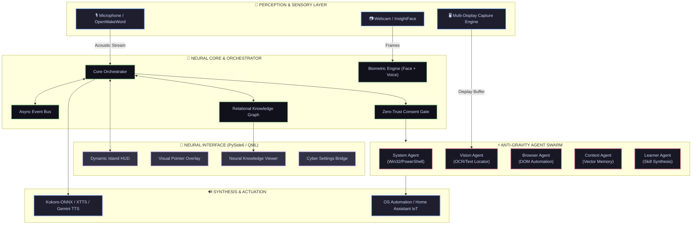

<div align="center">

```ascii
  ██████╗  █████╗ ██████╗ ██╗   ██╗    ███████╗████████╗██████╗ ██╗██╗  ██╗███████╗
  ██╔══██╗██╔══██╗██╔══██╗╚██╗ ██╔╝    ██╔════╝╚══██╔══╝██╔══██╗██║██║ ██╔╝██╔════╝
  ██████╔╝███████║██████╔╝ ╚████╔╝     ███████╗   ██║   ██████╔╝██║█████╔╝ █████╗  
  ██╔══██╗██╔══██║██╔══██╗  ╚██╔╝      ╚════██║   ██║   ██╔══██╗██║██╔═██╗ ██╔══╝  
  ██████╔╝██║  ██║██████╔╝   ██║       ███████║   ██║   ██║  ██║██║██║  ██╗███████╗
  ╚═════╝ ╚═╝  ╚═╝╚═════╝    ╚═╝       ╚══════╝   ╚═╝   ╚═╝  ╚═╝╚═╝╚═╝  ╚═╝╚══════╝
```

### ⚡ Autonomous Local-First Cybernetic Desktop Intelligence ⚡

*Neural Desktop Orchestration • Anti-Gravity Agent Swarm • Biometric Security Core • Zero-Cloud Privacy*

<br/>

[](https://www.python.org/)
[](https://wiki.qt.io/Qt_for_Python)
[](https://ollama.com)
[](https://onnxruntime.ai/)
[](https://microsoft.com/windows)
[](#-privacy--zero-cloud-guarantee)

<br/>

[Key Features](#-core-capabilities) •
[Architecture](#-system-architecture) •
[Dynamic Island HUD](#-dynamic-island-hud) •
[Agent Swarm](#-anti-gravity-multi-agent-swarm) •
[Quickstart](#-installation--quickstart) •
[Configuration](#-configuration)

---

</div>

<br/>

## 🌌 Overview

**BABY** is a local cybernetic desktop operating assistant engineered for Windows. Built from the ground up for **sub-second latency**, **extreme visual elegance**, and **uncompromising zero-cloud privacy**, BABY integrates local multimodal LLMs, voice biometric authentication, real-time computer vision, and an autonomous multi-agent swarm into a fluid glassmorphism **Dynamic Island HUD**.

Every neural inference—from Whisper speech decoding and Kokoro neural voice synthesis to multi-agent DAG task synthesis—executes **100% on your local silicon**.

---

## ⚡ Core Capabilities

<table>
  <tr>
    <td width="50%">
      <h3 align="center">🔮 Dynamic Island Glass HUD</h3>
      <p>A floating, reactive overlay built with PySide6 & QML. Features real-time neural audio waveform states, reactive micro-animations, on-screen visual pointer overlays, and granular hardware permission toggles.</p>
    </td>
    <td width="50%">
      <h3 align="center">🧠 Anti-Gravity Autonomous Swarm</h3>
      <p>A distributed DAG-based autonomous planner dividing complex objectives across specialized sub-agents: <code>System</code>, <code>Browser</code>, <code>Vision</code>, <code>Context</code>, and <code>Learner</code>.</p>
    </td>
  </tr>
  <tr>
    <td width="50%">
      <h3 align="center">🛡️ Biometric Security Core</h3>
      <p>Multi-factor biometric verification with InsightFace (Buffalo_L) 512-D face embeddings and Resemblyzer voiceprint identification, backed by encrypted SQLite storage (Fernet/AES-GCM).</p>
    </td>
    <td width="50%">
      <h3 align="center">🎙️ Neural Voice Subsystem</h3>
      <p>Continuous neural acoustic wake-word detection (<code>openWakeWord</code>), Silero VAD, ultra-fast Faster-Whisper STT with word timestamps, and Kokoro-ONNX / XTTS-v2 multilingual synthesis.</p>
    </td>
  </tr>
  <tr>
    <td width="50%">
      <h3 align="center">👁️ Spatial Vision & OCR Engine</h3>
      <p>Selective multi-monitor capture, high-precision OCR text localization, live webcam perception, and screen coordinate mapping with visual target guidance.</p>
    </td>
    <td width="50%">
      <h3 align="center">🕸️ Neural Relationship Graph</h3>
      <p>Dynamic knowledge graph maintaining temporal memory, relational links, and emotional valence across interactions, visually rendered via an interactive QML neural network viewer.</p>
    </td>
  </tr>
</table>

---

## 🏛️ System Architecture



---

## 🔮 Dynamic Island HUD

The user interface floats unobtrusively above Windows applications, adapting its geometry and pulse according to assistant state:

```
╭─────────────────────────────────────────────────────────────╮
│  ▶ BABY   │  🔊 42%  │  🎙 LIVE  │  🖥 DISPLAY 1  │  📷 READY   │
╰─────────────────────────────────────────────────────────────╯
        │            │           │              │
    Activation   Audio Vol   Mic State    Screen Share   Camera Access
```

### HUD State Machine

| State | Visual Indicator | Waveform Dynamic | Description |
|---|---|---|---|
| `IDLE` | `#7C7CFF` Neon Glow | Static subtle glow | Low-power standby awaiting wake-word or hotkey |
| `LISTENING` | `#00FFCC` Cyan Pulse | Real-time audio FFT bars | Active voice capture with Silero VAD gating |
| `THINKING` | `#FF007F` Plasma Wave | Orbiting gradient sweep | LLM inference & DAG agent plan formulation |
| `SPEAKING` | `#A020F0` Neural Violet | Fluid speech-synchronized bars | Kokoro / XTTS streaming voice output |
| `EXECUTING` | `#FFB800` Amber Pulse | Targeted highlight flash | System command / browser automation executing |

---

## ⚡ Anti-Gravity Multi-Agent Swarm

BABY decomposes high-level intent into directed acyclic graphs (DAG) of atomic actions dispatched across specialized micro-agents:

```
                     [ User Intent / Voice Input ]
                                  │
                                  ▼
                    ┌───────────────────────────┐
                    │ AntiGravity Swarm Planner │
                    └─────────────┬─────────────┘
                                  │
         ┌──────────────┬─────────┴────────┬──────────────┐
         ▼              ▼                  ▼              ▼
  ┌──────────────┐┌──────────────┐  ┌──────────────┐┌──────────────┐
  │ Vision Agent ││ System Agent │  │ Browser Agent││ Learner Agent│
  │ • OCR Scan   ││ • File I/O   │  │ • DOM Nav    ││ • Self-Heal  │
  │ • Text Find  ││ • App Launch │  │ • Web Scrape ││ • New Skills │
  │ • Cam Perceive││ • WinReg/PS  │  │ • Form Fill  ││ • DB Cache   │
  └──────────────┘└──────────────┘  └──────────────┘└──────────────┘
```

- **`SystemAgent`**: Shell execution, active window management, file tree manipulation, process control, system power & volume control.
- **`VisionAgent`**: Granular display capture, Tesseract OCR bounding box detection, UI button localization, camera frame analysis.
- **`BrowserAgent`**: Playwright/Chromium automation, intelligent web search scraping, form interaction.
- **`ContextAgent`**: Hybrid search over episodic memory, persistent SQLite knowledge graphs, and user preferences.
- **`LearnerAgent`**: Observes user workflows, dynamically compiles reusable Python skills, and indexes them into the local skill library.

---

## 🔒 Biometric Security Architecture

BABY guarantees that privileged commands (file deletion, credential access, personal data) execute **only for authorized administrators**.

```
  [ Webcam / Microphone ]
            │
            ├──► InsightFace (Buffalo_L) ──► 512-D Face Vector ──┐
            │                                                     ├──► Multi-Factor Verification
            └──► Resemblyzer (GE2E)     ──► 256-D Voice Vector ──┘             │
                                                                               ▼
                                                            [ AES-GCM Encrypted Biometrics DB ]
```

- **Face Recognition**: 512-dimensional facial embedding cosine comparison with configurable confidence thresholds.
- **Voice Identification**: Deep-learning generalized end-to-end (GE2E) speaker verification.
- **Admin Phrase Model**: Custom acoustic classifier trained on personal wake phrases (`"baby i am back"`).
- **At-Rest Encryption**: Biometric vectors and memory graphs encrypted with Fernet / AES-256 keys managed locally.

---

## 🚀 Installation & Quickstart

### Prerequisites

- **OS**: Windows 10 or Windows 11 (64-bit)
- **Python**: 3.11 or 3.12
- **Hardware**: Dedicated GPU recommended for local LLM (8GB+ VRAM), or CPU mode with quantized models.
- **Local Model Provider**: [Ollama](https://ollama.com) installed and running.

### 1. Clone & Setup Environment

```powershell
git clone https://github.com/your-username/BABY.git
cd BABY

# Create and activate Python virtual environment
python -m venv .venv
.\.venv\Scripts\Activate.ps1
```

### 2. Install Core Dependencies

```powershell
# Install pinned neural dependencies
pip install -r requirements.txt
pip install opencv-python
```

### 3. Initialize Local LLM & Models

```powershell
# Start local Ollama server and pull preferred weights
ollama pull llama3.2:1b
ollama serve
```

> **Tip**: For low-resource or instant test mode without Ollama, set `llm.test_mode: true` in `config.yaml`.

### 4. Launch BABY

```powershell
python main.py
```

---

## ⚙️ Configuration

System parameters can be adjusted via [config.yaml](file:///s:/CODE/BABY/config.yaml) or modified dynamically through the **Cyber Settings Bridge**:

```yaml
# ─── NEURAL LLM BACKEND ───────────────────────────────────────────────
llm:
  model: llama3.2:1b
  base_url: http://localhost:11434
  temperature: 0.7
  test_mode: false             # Set true for offline stub mode

# ─── SPEECH SYNTHESIS (TTS) ───────────────────────────────────────────
tts:
  engine: kokoro               # Options: kokoro | xtts | gemini | elevenlabs
  voice: Mahiru
  speed: 1.2
  sample_rate: 24000

# ─── SPEECH RECOGNITION (STT) ─────────────────────────────────────────
stt:
  model: small                 # Faster-Whisper: tiny | base | small | medium
  device: auto                 # cuda | cpu
  compute_type: float16

# ─── BIOMETRIC CONTROLS ───────────────────────────────────────────────
biometrics:
  face_enabled: true
  voice_enabled: true
  face_threshold: 0.65
  voice_threshold: 0.75

# ─── MULTI-AGENT HIVE ENGINE ──────────────────────────────────────────
hive:
  enabled: true
  auto_mode: true
  router_interval_s: 2.0
  circuit_breaker:
    max_consecutive_errors: 5
    max_output_tokens_per_min: 10000

# ─── HUD VISUAL SETTINGS ──────────────────────────────────────────────
ui:
  theme_color: "#7C7CFF"
  glass_opacity: 0.88
  island_x: 580
  island_y: 40
```

---

## ⌨️ Controls & Keybindings

| Shortcut / Trigger | Target Action |
|---|---|
| `Ctrl + F12` | Instant Wake-Up / Activate Dynamic Island |
| Voice Trigger `"Hey Baby"` | Acoustic Wake Activation (openWakeWord) |
| Voice Trigger `"Baby I am back"` | Admin Verification & Security Unlock |
| `Dynamic Island 🎙` | Toggle Microphone Hardware Mute |
| `Dynamic Island 🖥` | Launch Multi-Monitor Screen Selector |
| `Dynamic Island 📷` | Toggle Webcam Spatial Permission |
| `Tray Icon → Settings` | Open Interactive Cybernetic Dashboard |

---

## 📦 Project Tree

```
s:/CODE/BABY/
├── main.py                     # System entrypoint (PySide6 + Orchestrator boot)
├── build_exe.py                # Standalone Windows executable compiler
├── baby.spec                   # PyInstaller bundle specification
├── config.yaml                 # Core system parameters & neural flags
│
├── core/                       # Core engine: Orchestrator, EventBus, Config, Memory
│   ├── relationship_engine/    # Social & emotional relational graph engine
│   ├── consent_gate.py         # Zero-trust hardware permission enforcement
│   └── orchestrator.py         # Central sensory-neural routing pipeline
│
├── antigravity/                # Autonomous agent swarm & DAG planner
│   └── agents/                 # System, Browser, Vision, Context, Learner agents
│
├── hive/                       # Multi-agent mesh protocol, circuit breakers & router
├── audio/                      # STT (Whisper), TTS (Kokoro/XTTS), VAD (Silero), WakeWord
├── biometrics/                 # InsightFace ID, Resemblyzer Voice ID, Encrypted KeyDB
├── llm/                        # Ollama / AirLLM streaming client & model factory
├── tools/                      # Win32 automation, OCR, Web, IoT & Sandbox execution
├── ui/                         # PySide6 + QML Dynamic Island HUD & Visual Pointer
└── tests/                      # Pytest automated test suite (67 unit tests)
```

---

## 🛡️ Privacy & Zero-Cloud Guarantee

- **Air-Gapped Operation**: BABY is engineered to function entirely disconnected from the Internet.
- **Local Vectors & DB**: Biometric profiles, face embeddings, conversation histories, and relationship graphs remain stored strictly on local disk with encryption.
- **Explicit Consent**: Zero background screenshotting or camera streaming—hardware capture executes exclusively when granted through the Dynamic Island interface.

---

<div align="center">

**BABY — Built with Precision for the Next Era of Personal Computing.**

<sub>Crafted with Python, Qt QML, ONNX, and Local Machine Learning.</sub>

</div>
